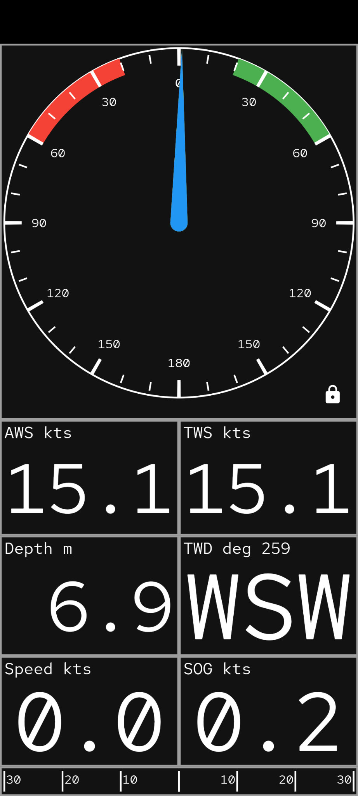
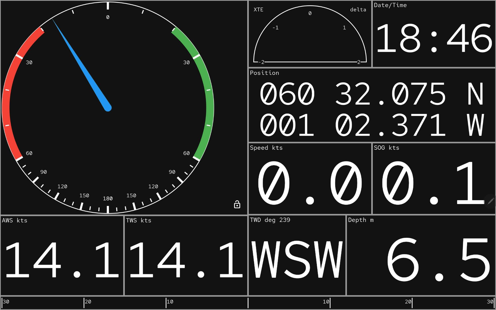
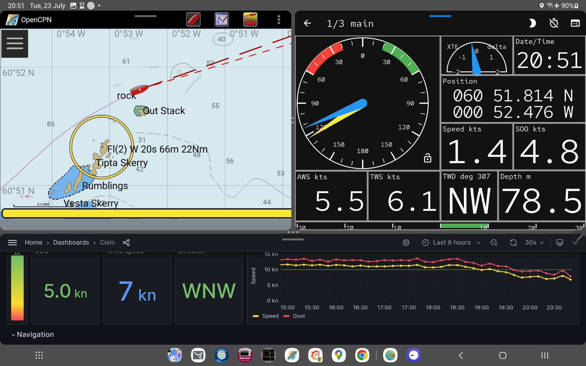
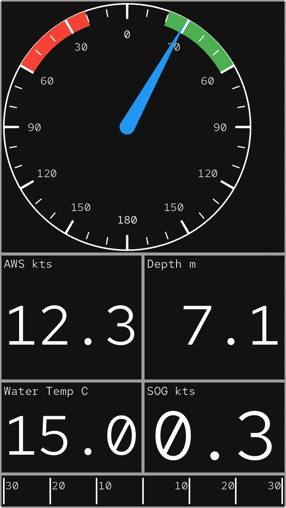
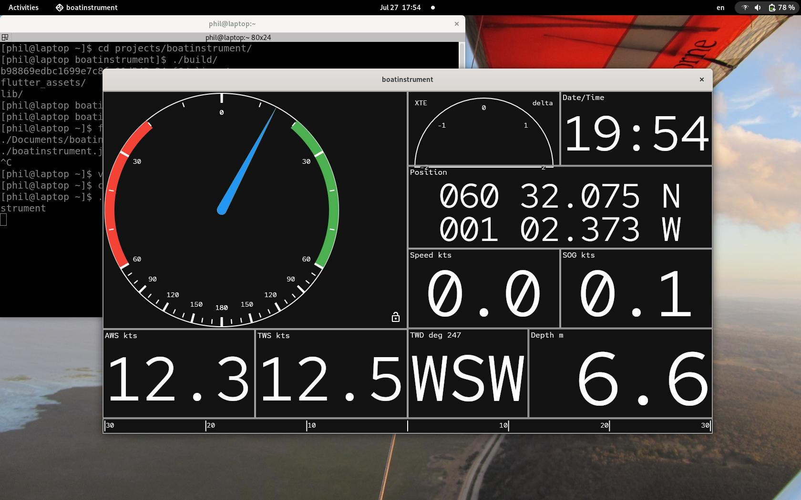
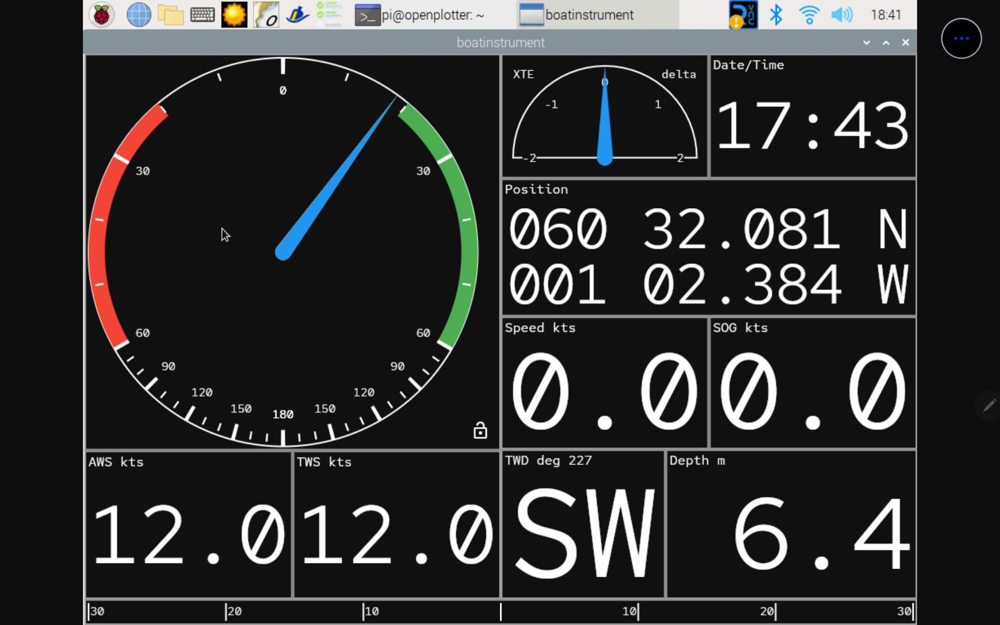
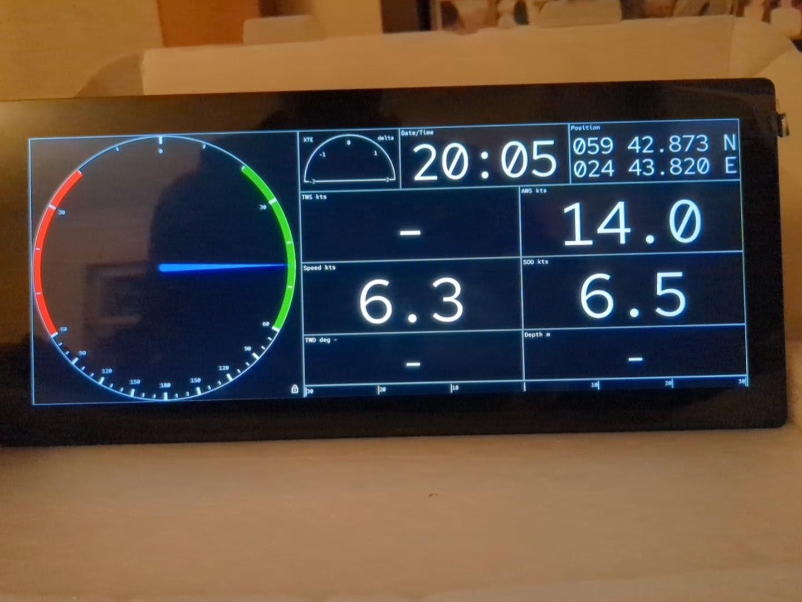
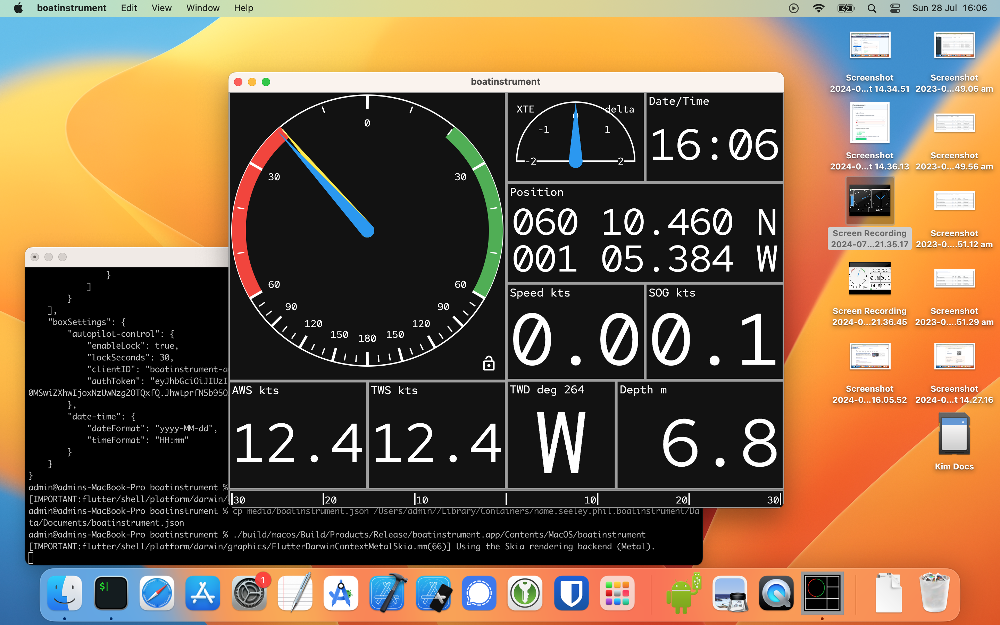

# Boat Instrument

A Boat Instrument for displaying data in fully configurable Boxes. The data is received via a subscription to a SignalK server.

<video src="media/demo.mov" width="400" controls></video>

# OS Support
The Boat Instrument is built on the Flutter framework and therefore runs on all Flutter supported platforms. It has been mainly tested on an Android Tablet, but all the following screenshots show it functioning on other platforms.

The main functionality will work on all platforms, but functions depending upon platform plugins may not work as expected, e.g. updating the screen brightness.

The configuration is stored in JSON format and can be exported/imported between instruments.

## Android
Phone:



Tablet:



Tablet tiled:



## iPhone



## Linux
Fedora:



Raspberry Pi 4 - X-Windows:

**Note:** Screenshot taken via VNC on a tablet.



Raspberry PI 4 - Flutter-Pi:

**Note:** very early version showing working on an HDMI monitor without X-Windows.



## MacOS
Ventura:



## Windows
Windows 10:


# Adding New Boxes

New Boxes can be added by sub-classing the BoxWidget. A simple example is:
```dart
class MyNewBox extends BoxWidget {

  // The config includes access to the instrument controller, widget sizes and settings.
  const MyNewBox(super.config, {super.key});

  @override
  State<MyNewBox> createState() => _MyNewBoxBoxState();

  // This value must be unique across all Boxes.
  static String sid = 'my-value';
  @override
  String get id => sid;
}

class _MyNewBoxState extends State<MyNewBox> {
  double? _myValue;

  @override
  void initState() {
    super.initState();
    // Configure the controller to request updates to the Signalk path(s) you require.
    // Note: this MUST be called even if not subscribing to any Signalk data
    widget.config.controller.configure(widget, onUpdate: _processData, paths: {'signalk.path.for.data'});
  }

  @override
  Widget build(BuildContext context) {
    return Column(mainAxisAlignment: MainAxisAlignment.center, children: [
      Text('My Value'),
      Text('$_myValue')
    ]);
  }

  // This will be called with updates to the Signalk paths you've asked for.
  // This simple case only asks for one path, so it assumes that's what's sent.
  _processData(List<Update>? updates) {
    if(updates == null) {
      _myValue = null;
    } else {
      try {
        _myValue = (updates[0].value as num).toDouble();
      } catch (e) {
        widget.config.controller.l.e("Error converting $updates", error: e);
      }
    }

    if(mounted) {
      setState(() {});
    }
  }
}
```
Once defined, the new Box must be added to the configuration menu in the Edit Page:
```dart
List<BoxDetails> boxDetails = [
  BoxDetails(BlankBox.sid, 'Blank', (config) {return BlankBox(config, key: UniqueKey());}), // This is the default Box.
  BoxDetails(HelpBox.sid, 'Help', (config) {return HelpBox(config, key: UniqueKey());}), // This is the default Box.
  BoxDetails(DepthBox.sid, 'Depth', (config) {return DepthBox(config, key: UniqueKey());}),
  BoxDetails(MyNewBox.sid, 'My Value', (config) {return MyNewBox(config, GaugeOrientation.down, key: UniqueKey());}),
];
//<snip...>
  _getWidgetMenus(_Box box) {
    List<PopupMenuEntry<BoxDetails>> popupMenuEntries = [
      _widgetMenuEntry(BlankBox.sid),
      _widgetSubMenuEntry(box, 'Environment', [
        _widgetMenuEntry(DepthBox.sid),
        _widgetMenuEntry(WaterTemperatureBox.sid)]),
      _widgetMenuEntry(MyNewBox.sid)
    ];

    return popupMenuEntries;
  }
```
Boxes can have Box type and/or Box instance settings. The
[DateTimeBox](lib/widgets/date_time_box.dart) is a good example of a
Box that has both Box Type and per-Box settings.

If the new Box is to display a single value, consider subclassing the
[DoubleValueBox](lib/widgets/double_value_box.dart). There are also base classes for Circular, Semi-Circular and Bar Gauges, see [gauge_box.dart](lib/widgets/gauge_box.dart).

For Boxes with settings, the JSON serialising code should be generated with:
```shell
dart run build_runner build --delete-conflicting-outputs
```